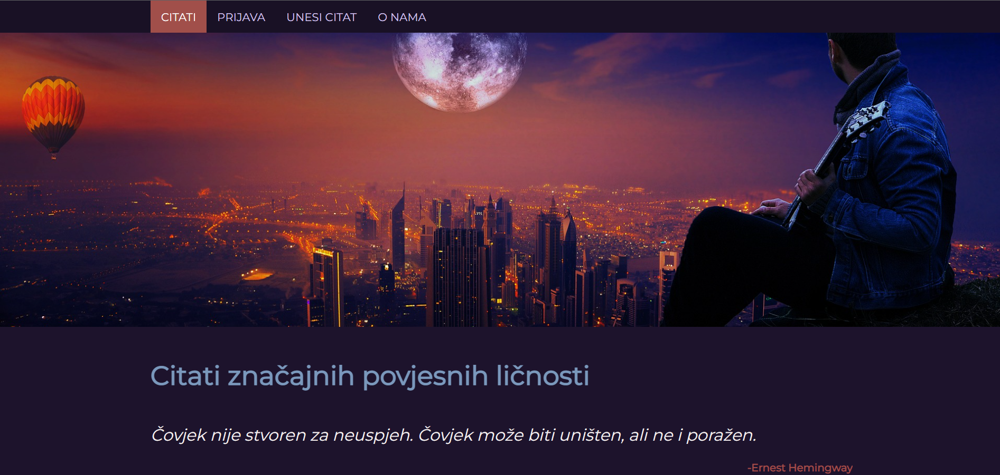

# Quotes app

`Quotes app` is a project that allows users to read handpicked quotes from various authors, including philosophers, writers, spiritual thinkers, great leaders, actors, singers, etc. Users can also register and publish quotes they identify with. 

The project was created for a university subject called "XML programming".  
  

 
  
## Installation and setup
To run this project, you'll need a server that provides the possibility of interpreting PHP code like XAMPP, WampServer, EASYPHP, AMPPS, etc.

The main content will be visible once you open the **`main.xml`** file.

 
  
## Showcase 

 

## Tech and tools used

